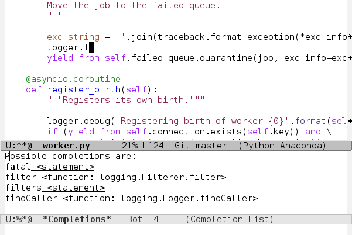
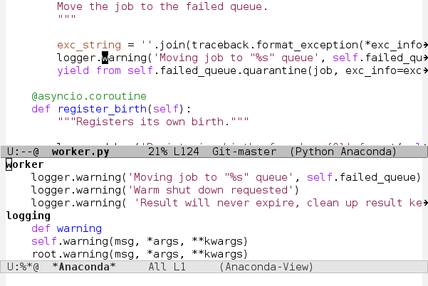

.. |travis| image:: https://img.shields.io/travis/proofit404/anaconda-mode.svg?style=flat-square
    :target: https://travis-ci.org/proofit404/anaconda-mode
    :alt: Build Status

.. |coveralls| image:: https://img.shields.io/coveralls/proofit404/anaconda-mode.svg?style=flat-square
    :target: https://coveralls.io/r/proofit404/anaconda-mode
    :alt: Coverage Status

.. |requires| image:: https://img.shields.io/requires/github/proofit404/anaconda-mode.svg?style=flat-square
    :target: https://requires.io/github/proofit404/anaconda-mode/requirements
    :alt: Requirements Status

.. |melpa| image:: http://melpa.org/packages/anaconda-mode-badge.svg
    :target: http://melpa.org/#/anaconda-mode
    :alt: Melpa

.. |melpa-stable| image:: http://stable.melpa.org/packages/anaconda-mode-badge.svg
    :target: http://stable.melpa.org/#/anaconda-mode
    :alt: Melpa Stable


===============
 Anaconda mode
===============

|travis| |coveralls| |requires| |melpa| |melpa-stable|

Code navigation, documentation lookup and completion for Python.






Features
--------
Anaconda mode provides the following features

* context-sensitive code completion
* jump to definitions
* find references
* view documentation
* virtual environment
* eldoc mode
* all this stuff inside vagrant and remote hosts

Supported Python Versions
-------------------------
2.6, 2.7, 3.3, 3.4

Installation
------------

To use this package you need to install ``pip``.

package.el
``````````

All you need to do is install the package from Melpa_::

    M-x package-install RET anaconda-mode RET

Manual
``````

Clone this repository somewhere and add this directory to your
``load-path``.

Prelude
```````

``anaconda-mode`` is included in the `Emacs Prelude`_ distribution.  You
can use it as well.  Look at the ``prelude-python`` module to see more
details.

Spacemacs
`````````

``anaconda-mode`` is included in the Spacemacs_ distribution.  You can use
it as well.  Look at the ``python`` language layer to see more details.

Configuration
-------------

You can automatically enable ``anaconda-mode`` in all python buffers
with following code in your configuration:

.. code:: lisp

    (add-hook 'python-mode-hook 'anaconda-mode)

ElDoc
`````

``anaconda-eldoc-mode`` provide document function to ``eldoc-mode``.  All
you need is to enable ``anaconda-eldoc-mode`` in addition to the previous setup.

.. code:: lisp

    (add-hook 'python-mode-hook 'anaconda-eldoc-mode)

Usage
-----

To start a completion press ``C-M-i``.  This is the standard emacs binding
for ``complete-at-point`` function.  You can use company-mode_ with
company-anaconda_ backend to get more intelligent ui.  Or
auto-complete-mode_ with ac-anaconda_ as a last try.

Interactive commands
````````````````````

Here is a list of interactive commands available with anaconda-mode

==========  ==============================
Keybinding  Description
==========  ==============================
C-M-i       anaconda-mode-complete
M-.         anaconda-mode-find-definitions
M-,         anaconda-mode-find-assignments
M-r         anaconda-mode-find-references
M-*         anaconda-mode-go-back
M-?         anaconda-mode-show-doc
==========  ==============================

If multiple candidates are found for definitions, assignments or usages, 
you'll see an advanced anaconda navigator buffer.

PYTHONPATH
``````````

You can add your project to the Emacs ``PYTHONPATH``.  If you store project
dependencies somewhere on your machine, you can add them as well.

.. code:: lisp

    (add-to-list 'python-shell-extra-pythonpaths "/path/to/the/project")
    (add-to-list 'python-shell-extra-pythonpaths "/path/to/the/dependency")

Virtual environment
```````````````````

Use a virtual environment to isolate your project dependencies from
others on the system.  You can additionally install your project in an editable
mode in the virtual environment.  This will improve search functionality.
Then activate this virtual environment inside Emacs.

::

    M-x pythonic-activate RET /path/to/virtualenv RET

Also you can use `pyenv-mode`_ or similar package to hold virtual
environment in actual state.

Each action above applies to ``anaconda-mode`` immediately.  The next
``anaconda-mode`` command you call will use this environment for
search completion candidates.

Tramp
`````

It's possible to use anaconda-mode on a remote server when you connect
to it using tramp.  Anaconda-mode can search for completion candidates
and all other stuff on remote server while you running Emacs locally.
First of all open interesting remote file.

::

    C-x C-f /ssh:remote_host:project/__init__.py RET

After tramp successfully connects and you see actual buffer
content, activate the remote virtual environment.

::

    M-x pythoninc-activate RET /ssh:remote_host:/home/user/venv RET

Now any anaconda-mode command will use ``/home/user/venv/bin/python``
interpreter running on ``remote_host`` over ssh.  If you don't use the
virtual environment remotely then you have an option to specify the remote
interpreter directly.

.. code:: lisp

    (setq python-shell-interpreter "/ssh:remote_host:/usr/bin/python")

It is important to remember that ``remote_host`` must be a real host
name or an IP address.  SSH aliases not allowed to be used with
anaconda-mode.  Also port 9000 on the remote host should be open to
incoming connections from your local machine.  A final note about project scope: 
all kinds of searching from inside the
virtual environment are available from any buffer.  However searching inside your
project is available only if you open it on the same machine as the
interpreter.

Vagrant
```````

You can get all the intelligent features of anaconda-mode with virtual
environments deployed on your vagrant box.  Add a port forwarding line to
your Vagrantfile.

::

   config.vm.network "forwarded_port", guest: 9000, host: 9000

Fire up vagrant machine as usual and open your project inside vagrant
box.

::

    C-x C-f /ssh:vagrant@localhost#2222:/vagrant/polls/views.py

Then activate your project environment installed inside vagrant.

::

    M-x pythonic-activate RET /ssh:vagrant@localhost#2222:/vagrant/polls/venv RET

Remember that the standard password for vagrant user is ``vagrant``. It is
too annoying to type this password each time you want to connect.  I
use ``ssh-copy-id`` to upload my public ssh key the box.

::

    ssh-copy-id vagrant@localhost -p 2222

If you have random connection errors during interaction with running
server - try to replace host name with IP address.  For example
``localhost`` with ``127.0.0.1``.

Now you are ready to go.

Implementation details
----------------------

Anaconda mode comes with ``anaconda_mode.py`` server.  This server
allows you to use the jedi_ python library over jsonrpc api.  The server chooses
first available port starting from 9000.  Anaconda mode will run this
server automatically on first call of any anaconda-mode command.

This means that completion results and reference searches depend on your
project installation.

Bug Reports
-----------

Please attach ``*anaconda-mode*`` buffer content to every created
issue.

Issues
------

DistutilsOptionError
````````````````````

::

    DistutilsOptionError: must supply either home or prefix/exec-prefix -- not both

This occurs due to `distutils bug
<http://bugs.python.org/issue22269>`_ when ``pip -t`` option conflict
with ``distutils.cfg`` ``prefix`` option.  If you install ``pip`` with
``homebrew`` you are on fire.  There are few options to avoid this
issue.

- install ``anaconda-mode`` `dependencies
  <https://github.com/proofit404/anaconda-mode/blob/master/requirements.txt>`_
  manually
- remove ``prefix`` option from ``distutils.cfg``

AttributeError and KeyError randomly happens
````````````````````````````````````````````

These kinds of problems were reported with jedi 0.9 version.  You can
try to downgrade jedi version down to 0.8.

::

   M-: (dired (anaconda-mode-server-directory)) RET
   M-! rm -rf jedi* RET
   M-! pip install "jedi<0.9" -t . RET

Contributions
-------------

Are very welcome.  But any significant change has to be accompanied
with tests, both for Emacs Lisp and Python code.  To run the test
suite, call:

.. code:: shell

    tox

Thanks
------

* Dmitry Gutov **@dgutov**
* Bo Lin **@sadboy**
* Vasilij Schneidermann **@wasamasa**
* Fredrik Bergroth **@fbergroth**
* Fabio Corneti **@fabiocorneti**
* Tom Davis **@tdavis**
* Sviridov Alexander **@sviridov**
* Mario Rodas **@marsam**

.. _Melpa: http://melpa.milkbox.net/
.. _pyenv-mode: https://github.com/proofit404/pyenv-mode
.. _jedi: http://jedi.jedidjah.ch/en/latest/
.. _emacs prelude: https://github.com/bbatsov/prelude
.. _spacemacs: https://github.com/syl20bnr/spacemacs
.. _company-mode: http://company-mode.github.io/
.. _company-anaconda: https://github.com/proofit404/company-anaconda
.. _auto-complete-mode: https://github.com/auto-complete/auto-complete
.. _ac-anaconda: https://github.com/proofit404/ac-anaconda
