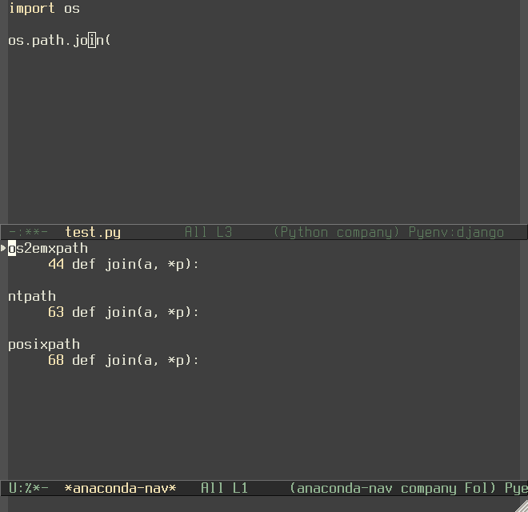

Anaconda mode
=============

.. image:: https://travis-ci.org/anaconda-mode/anaconda-mode.png
    :target: https://travis-ci.org/anaconda-mode/anaconda-mode
    :alt: Build Status

.. image:: https://gemnasium.com/anaconda-mode/anaconda-mode.png
   :target: https://gemnasium.com/anaconda-mode/anaconda-mode
   :alt: Dependency Status

.. image:: https://coveralls.io/repos/anaconda-mode/anaconda-mode/badge.png
   :target: https://coveralls.io/r/anaconda-mode/anaconda-mode
   :alt: Coverage Status

Code navigation, documentation lookup and completion for Python.



This mode support 2.6, 2.7, 3.3 and 3.4 Python versions and provide
following features

* context-sensitive code completion
* jump to definitions
* find references
* view documentation
* virtual environment
* eldoc mode

Installation
------------

All you need is install the package from Melpa_::

    M-x package-install RET anaconda-mode RET

Usage
-----

By default ``anaconda-mode`` starts its HTTP server on port ``24970``
for interaction with Python process.  You may want to close this port
for incoming network connections.  This server will start
automatically when you call any anaconda command like reference search
or documentation lookup.  To start ``anaconda-mode`` automatically in
all python buffers add following to your configuration.

.. code:: lisp

    (add-hook 'python-mode-hook 'anaconda-mode)

Anaconda mode detect active virtual environment through value of
``python-shell-virtualenv-path`` variable defined in ``python.el``
library.  When you set it to actual virtualenv path next anaconda-mode
command you call will restart its python process in proper environment
before performing this call.  This allow anaconda processing
virtualenv site-packages with minimum number of actions from your
side.  I strongly recommended you to use `pyenv-mode`_ or similar
package to hold ``python-shell-virtualenv-path`` in actual state.

Interactive commands
````````````````````

Here are interactive commands available with anaconda-mode

==========  ==============================
Keybinding  Description
==========  ==============================
M-.         anaconda-mode-goto-definitions
M-*         anaconda-nav-pop-marker
M-?         anaconda-mode-view-doc
M-r         anaconda-mode-usages
==========  ==============================

If goto definitions, assignments or usages cause multiple candidates
you'll see advanced anaconda navigator buffer.

ElDoc
`````

``anaconda-mode`` provide document function to ``eldoc-mode``.  All
you need is enable ``eldoc-mode`` in addition to previous setup.

.. code:: lisp

    (add-hook 'python-mode-hook 'eldoc-mode)

Known Issues
------------

If you're using proxy server, you have to make sure that the proxy is
not used for communication with anaconda-mode:

.. code:: shell

    export no_proxy="localhost,127.0.0.1"

Contributions
-------------

Are very welcome.  But any significant change has to be accompanied
with tests, both for Emacs Lisp and Python code.  To run the test
suite, call:

.. code:: shell

    tox

Thanks
------

* Dmitry Gutov **@dgutov**
* Bo Lin **@sadboy**
* Vasilij Schneidermann **@wasamasa**
* Fredrik Bergroth **@fbergroth**

.. _Melpa: http://melpa.milkbox.net/
.. _pyenv-mode: https://github.com/proofit404/pyenv-mode
